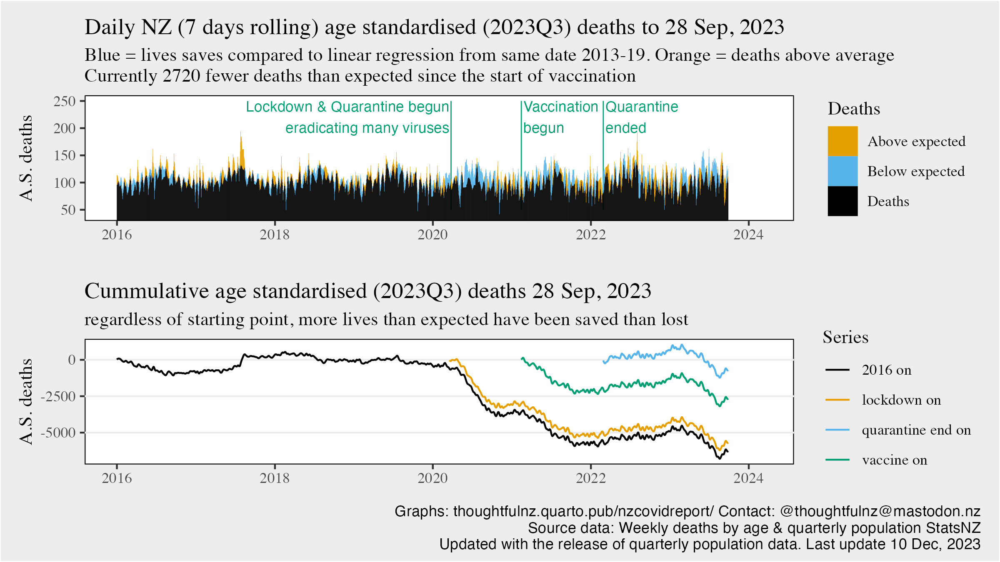

```{r setup, include=FALSE}
knitr::opts_chunk$set(echo = TRUE)
```

## The Issue

The Our World in Data weekly "projected" (rather than "average") mortality graphs compare deaths in a week to a straight line linear regression of deaths in equivalent weeks 2015-2019. This has the huge advantage that being based on season matched subnational time periods it is possible to do "excess since" calculations from the exact arrival of covid. It has the disadvantage that using only deaths creates error by ignoring changes in the age structure (and the NZ age structure has had huge changes from 2015 to 2023). This approach is (of course) limited to the set of countries with both weekly deaths by age and population by age, but you might as well get the best information out of the best reporting countries. Particularly if you live in one of those 40 or so countries and want to understand it better.

Also there are a few tiny issues with equivalent weeks in previous years to do with years not being an exact number of weeks long- This can be fixed at the same time (this tends to be more of a problem if aggregating weekly data into larger units which are sensitive to seasonal effects if the week's temporal wandering is at a high change period (which I am not doing in this, but it is better to sort the data out from the start)).

## Sources

Weekly deaths by age from <https://www.stats.govt.nz/experimental/covid-19-data-portal> downloaded as an excel file

Population by age from <https://infoshare.stats.govt.nz> : Population : Population Estimates - DPE : Estimated Resident Population by Age and Sex (1991+) (Qrtly-Mar/Jun/Sep/Dec), Estimate Type: As At, Population Group: Total, Observations: Select All, Time: Select All. Download as Comma Seperated (csv)

```{r r_libraries_used}
library(readxl)
library(readr)
library(dplyr)
library(tidyr)
library(lubridate)
library(ggplot2)
library(ggthemes)

```

# Get weekly ASM(R) values

In New Zealand case, for this think piece, I am using deaths by week and population by quarter. For any other country you need deaths and population, but given both of those you can get death rates by age and so Age Standardised Mortality or the added step of Age Standardised Mortality Rates.

One longterm quirk is the comparison of ISO weeks drifts a bit, and has a problem with most ISO years having 364 day, then occasionally 371. Which makes when exactly in the past you are comparing to for building trends a bit of an issue. To solve a lot of those problems, I am disaggregate the subannual week and quarter periods to individual days.

In disaggregating one approach is to assign deaths/7 to each day in the week, which emphasises the distinctiveness of the individual week unit. The other approach is to smooth with surrounding weeks to make days, assigning deaths/7 to the midweek day and interpolating the values to the next. I prefer the second option as it emphasises the continuity of days. It does only really matter if you were single out a few individual days between different methods, the overall multiyear trends aren't affected.

```{r dataread, warning=FALSE, message=FALSE}
deathfile <- read_excel("covid_19_data_portal.xlsx", sheet="data") |> 
  mutate(dailyAverage = Value/7,
         weekMid = ymd(Period) - days(4)) |> 
  select(weekMid, ageGroup = Label1, dailyAverage) |> 
  filter(ageGroup != "Total")

popfile <- read_csv("DPE403901_20240108_072526_78.csv", skip=3) |> 
  rename(YQ = 1) |> 
  filter(!is.na(`0 Years`)) |> 
  mutate(`Under 30` = `Under 20 Years` + `20-24 Years` + `25-29 Years`,
         `30 to 59` = `20 Years and Over` - `20-24 Years` - 
           `25-29 Years` - `60 Years and Over`,
         `60 to 79` = `60 Years and Over` - `80 Years and Over`,
         `80 and over` = `80 Years and Over`,
         Yr = gsub("Q.*","", YQ),
         Qr = as.numeric(gsub(".*Q","", YQ)),
         Qcurrent = ceiling_date(ymd(paste0(Yr,"-",Qr*3,"-25")),unit = "quarter") - days(1)) |> 
  select(Qcurrent, `Under 30`, `30 to 59`, `60 to 79`, `80 and over`) |> 
  gather(key = "Label1", value = "currentPopulation", 2:5)
```

```{r make_interpolation_rates}
deathoffset <- deathfile |> 
  arrange(ageGroup, weekMid) |> 
  group_by(ageGroup) |>
  mutate(nextAV=lead(dailyAverage),
         basedate = weekMid,
         dailyRate = (nextAV - dailyAverage)/7) |> 
  ungroup() |> 
  select(weekMid, Label1=ageGroup, basedate, dailyAverage, dailyRate)


popoffsets <- popfile |> 
  arrange(Label1, Qcurrent) |> 
  group_by(Label1) |> 
  mutate(Qnext = lead(Qcurrent),
         basedate = Qcurrent,
         nextPopulation = lead(currentPopulation),
         Qdays = as.numeric(difftime(Qnext, Qcurrent, units = "days")),
         Qchange = nextPopulation -currentPopulation,
         dailyRate = Qchange/Qdays) |> 
  ungroup() |> 
  select(Qcurrent, Label1, basedate, currentPopulation, dailyRate)

```

```{r make_daily}
everyDeath <- expand.grid(weekMid = seq.Date(from=min(deathoffset$weekMid),
                                to=max(deathoffset$weekMid),
                                by="day"),
                       Label1 = unique(deathoffset$Label1)) |> 
  left_join(deathoffset, by = join_by(weekMid, Label1)) |> 
  arrange(Label1, weekMid) |> 
  group_by(Label1) |> 
  fill(basedate, dailyAverage, dailyRate) |> 
  ungroup() |> 
  mutate(daysIn = as.numeric(difftime(weekMid, basedate, units = "days")),
         Deaths = dailyAverage + daysIn * dailyRate) |> 
  select(theDate = weekMid, Label1, Deaths)

everyPop <- expand.grid(Qcurrent = seq.Date(from=min(popoffsets$Qcurrent),
                                to=max(popoffsets$Qcurrent),
                                by="day"),
                       Label1 = unique(popoffsets$Label1)) |> 
  left_join(popoffsets, by = join_by(Qcurrent, Label1)) |> 
  arrange(Label1, Qcurrent) |> 
  group_by(Label1) |> 
  fill(basedate, currentPopulation, dailyRate) |> 
  ungroup() |> 
  mutate(daysIn = as.numeric(difftime(Qcurrent, basedate, units = "days")),
         Population = currentPopulation + daysIn * dailyRate) |> 
  select(theDate = Qcurrent, Label1, Population)

DeathRates <- everyDeath |> 
  inner_join(everyPop, by = join_by(theDate, Label1)) |> 
  mutate(percapita = Deaths/Population)
```

## The standard in ASM(R)

The standard in ASM(R) is dealing with the risk of death being different for different ages, and the age structure being different in different years, by adopting the best practice approach for the past few centuries (since 1844) of adding "if the age structure was unchanged". To do this we apply the age structure of a standard year and place to the the range of death rates in the data.

As I live in NZ, and am most interested in what it means to present day New Zealand, I tend to use the latest NZ population figures (as at the end of the most recently published quarter) to get current NZ equivalent death, but there are many international standard age sets used to make the results less specific to any one country.

```{r}
standardages <- popfile |> 
  filter(Qcurrent == max(Qcurrent)) |> 
  select(Label1, standardpop = currentPopulation)
ASM_components <- DeathRates |> 
  inner_join(standardages, by = join_by(Label1)) |> 
  mutate(ASM = standardpop * percapita)
# if you want to explore age specific mortality
# this is the step after which the Age standardisation diverges
# so you might want to save the components.
write.csv(ASM_components, file = "asm_components.csv", row.names = FALSE)
```

## Expected Deaths

Excess mortality is based on the difference between actual and expected deaths, where standard practice is a linear regression vs a previous period of "normality".

Because, for New Zealand, using a period starting before 2012 introduces structural error underestimating deaths (I've written about this elsewhere, but to convince yourself just check for yourself how accurate predictions of 2017-19 are when using 2012-2016, 2011-2016, 2010-2016, 2009-2016, and 2008-2016) I estimate for minimal introduced error use 2013-2019.

This does involve running about 20,000 independent linear regressions. The code can be parallelised in various ways if you don't want to wait a couple of minutes for a non-optimised version to run, but I am presenting the basic code here.

```{r}
# have a custom function for picking out the dates to regress on,
# calculating the regression, then the expected date
# much the same thing could be done with ASMR

calculate_expected <- function(x, referencedata=ASM, startyear=2013){
  tomanydates <- c(x + days(round(365.25 * -12:12, 0)))
  # using 365.25 so cummlative leap years never cause more than 1 days variation in the time period
  # another approach would be to hard code a lookup table comparison
  # but for a maximum 1 days variation in death rates I'm opting for the
  # simple, vectorised calculation
  ydata <- referencedata |> filter(theDate %in% tomanydates,
                                    year(theDate) %in% startyear:2019)
  ymodel <- lm(ASM ~ theDate, ydata)
  coef1 = unname(ymodel$coefficients[1])
  coef2 = unname(ymodel$coefficients[2])
  output <- data.frame(theDate = x, coef1, coef2,
                       expected = coef1 + as.numeric(x)* coef2)
  # returning the coffecients rather than just the result so it is easier
  # to review the method, the trusting could rewrite it to return 
  # just the expected value
  return(output)
}

# aggregate the component ASM to standard deaths per day
ASM <- ASM_components |> 
  summarise(.by=theDate,
            rawDeath = sum(Deaths),
            rawPop = sum(Population),
            ASM = sum(ASM),
            ASMR = ASM / sum(standardpop))
expectedList = lapply(ASM$theDate, calculate_expected)
expectedDF = bind_rows(expectedList)
ASMactexp <- ASM |> inner_join(expectedDF, by = join_by(theDate))

# worth saving to explore more
write.csv(ASMactexp, file = "asm_w_expected.csv", row.names = FALSE)
```

At this point you can just subtract out the exact time period of interest and do daily or cummulative standard counts (sum(actual)- sum(expected))

## A thought on presentation

Given the data at this point, it is possible to show lives saved and lost relative to expected and also show cumulative effects over time from multiple starting points. I think that is highly informative way to present things.

{fig-alt="Age Standardised"}
